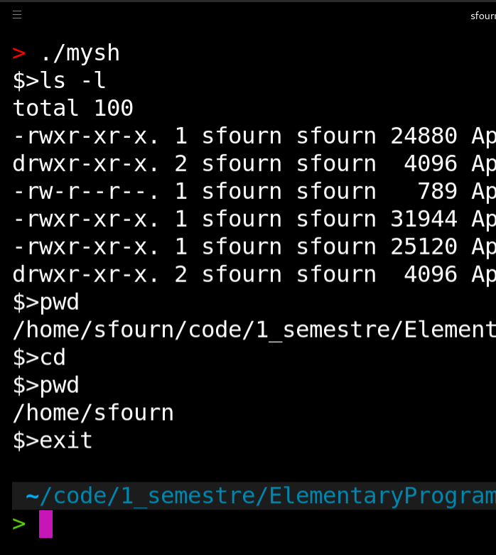

# Minishell


___
## Unix Command interpreter based on TCSH

I have implemented the following buitlins :
- cd
- env
- setenv
- unsetenv
- exit
___
## Usage example

``` tcsh
make
./mysh
$> ls -l
total 48
drwxr-xr-x. 2 sfourn sfourn  4096 May  7 09:44 include
-rw-r--r--. 1 sfourn sfourn   789 May  7 09:45 Makefile
-rwxr-xr-x. 1 sfourn sfourn 31944 May  7 09:53 mysh
-rw-r--r--. 1 sfourn sfourn   830 May  7 09:53 README.md
drwxr-xr-x. 2 sfourn sfourn  4096 May  7 09:53 src
$> cd
$> pwd
/home/$HOME
$> exit
```
With this project I learned to use the `fork()` function, understand how to handle signals with PID and interact with the env.
___
Check my [portfolio](http://simonlefourn.com) for more informations on this project.

